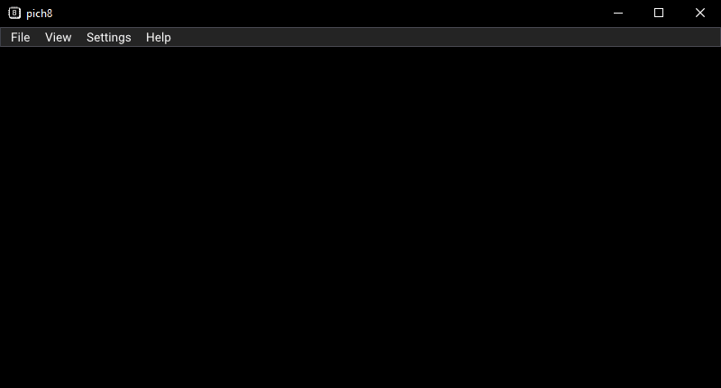
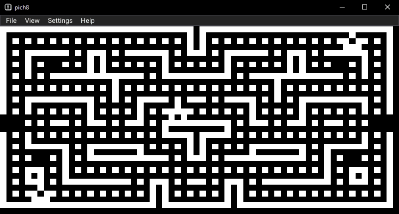
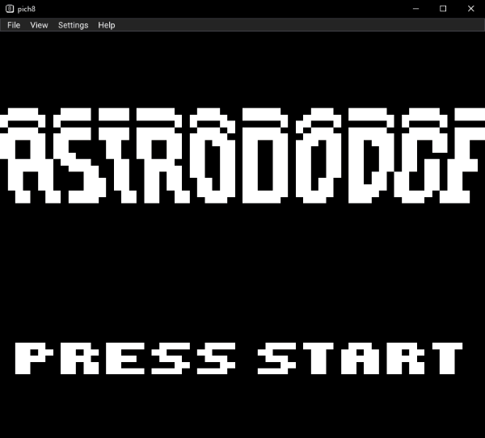
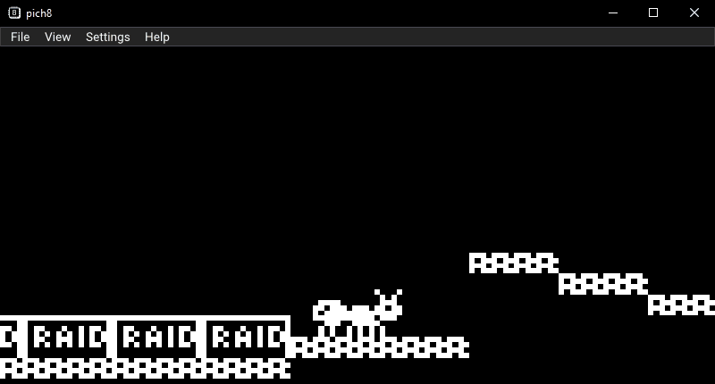
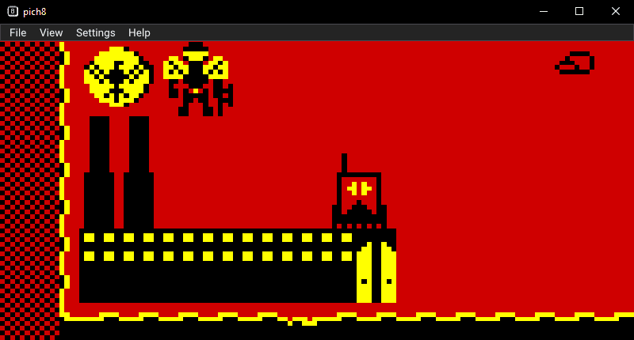
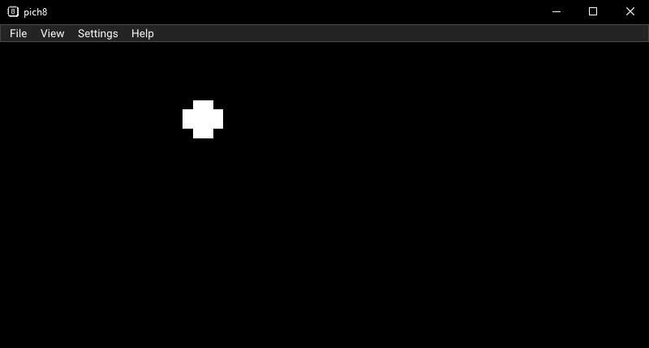
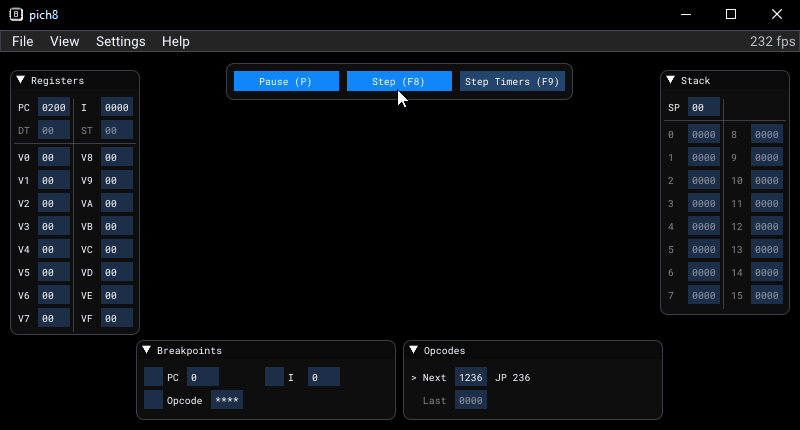

# pich8
A cross-platform CHIP-8, SUPER-CHIP and XO-CHIP interpreter and debugger written in Rust


[](https://deps.rs/repo/github/philw07/pich8)

I've recently decided to look into emulators and found many recommendations to start with a CHIP-8 interpreter.  
Since I had just started to read [the book](https://doc.rust-lang.org/book/), I've decided to use this opportunity as my first Rust project.  
I can definitely recommend giving it a try, I learned a lot during this journey.

I'm currently porting the emulator to Go, check out [pich8-go](https://github.com/philw07/pich8-go).



## Features

- Cross-platform
- Support for CHIP-8, SUPER-CHIP 1.1 (S-CHIP) and XO-CHIP
- Supports screen resolutions 64x32 (CHIP-8 Default), 64x64 (CHIP-8 HiRes) and 128x64 (S-CHIP, XO-CHIP)
- Rendering and sound using native Rust crates [glium](https://github.com/glium/glium) and [rodio](https://github.com/RustAudio/rodio)
- GUI using crate [imgui-rs](https://github.com/Gekkio/imgui-rs) (Rust bindings for [Dear ImGui](https://github.com/ocornut/imgui))
- Load ROMs from local file system or download them directly from a URL
- Save and load current CPU state
- Fullscreen mode and possibility to change background and foreground colors
- Change CPU speed dynamically
- Enable or disable several quirks (some ROMs require specific quirks)  
- Debug windows displaying current register values, stack and executed opcodes as well as allowing to set breakpoints

## Screenshots

CHIP-8 ROM Blinky  


CHIP-8 HiRes ROM Astro Dodge  


S-CHIP ROM Ant  


XO-CHIP ROM Red October  


Changing colors using presets or individually  


Debugging ROM  


## Compatibility

During my testing, I haven't come across any ROM which did not work correctly, some ROMs however require specific settings.  
Without going too much into detail, the following are just guidelines and some ROMs may behave differently.

- Quirks
  - The default setting usually works good for legacy ROMs, however some title may need specific quirks turned off.
  - Modern ROMs written with Octo usually use different settings, therefore an Octo preset is included.
- CPU speed
  - Legacy CHIP-8 ROMs usually work well around the default speed setting.
  - S-CHIP ROMs usually require one of the faster speed settings.
  - XO-CHIP ROMs often require significantly higher speeds, therefore a 50x multiplier is available.

## Key Mapping

As with most other emulators, the keys are mapped as follows.  
On other keyboard layouts it should be the same keys (not the same characters) as the keys are determined by scancode.

```
    Keyboard                     CHIP-8
┌───┬───┬───┬───┐           ┌───┬───┬───┬───┐
│ 1 │ 2 │ 3 │ 4 │           │ 1 │ 2 │ 3 │ C │
├───┼───┼───┼───┤           ├───┼───┼───┼───┤
│ Q │ W │ E │ R │           │ 4 │ 5 │ 6 │ D │
├───┼───┼───┼───┤     →     ├───┼───┼───┼───┤
│ A │ S │ D │ F │           │ 7 │ 8 │ 9 │ E │
├───┼───┼───┼───┤           ├───┼───┼───┼───┤
│ Z │ X │ C │ V │           │ A │ 0 │ B │ F │
└───┴───┴───┴───┘           └───┴───┴───┴───┘
```

## Building

Make sure the rust toolchain is installed (on Windows both gnu and msvc are fine), best using [rustup](https://rustup.rs/).

### Windows

You can simply build using cargo or run directly.
```
> cargo build
```

### Linux

You need to install the required packages, on a Debian/Ubuntu based system:
```
$ sudo apt install gcc g++ libasound2-dev libssl-dev
$ cargo build
```
On a Fedora based system:
```
$ sudo yum install g++ alsa-lib-devel openssl-devel
$ cargo build
```
 
If you run `cargo build --no-default-features`, you won't need the openssl package, but then it's not possible to download ROMs from the internet.

Note: I couldn't get the application to run in a Linux VM due to [this issue in glutin](https://github.com/rust-windowing/glutin/issues/1262).

### macOS

I have no macOS system, but I assume it should work if you have a proper build system installed.

## Sources for CHIP-8 ROM files

- https://github.com/JohnEarnest/chip8Archive
- https://johnearnest.github.io/chip8Archive/
- https://www.zophar.net/pdroms/chip8.html
- https://github.com/loktar00/chip8/tree/master/roms
- https://github.com/dmatlack/chip8/tree/master/roms
- https://github.com/00laboratories/00SChip8/tree/master/games

## Resources

- https://github.com/tobiasvl/awesome-chip-8
- http://www.pong-story.com/chip8/ (especially CHIP8.DOC)
- http://devernay.free.fr/hacks/chip8/C8TECH10.HTM
- http://devernay.free.fr/hacks/chip8/schip.txt
- http://devernay.free.fr/hacks/chip8/
- http://johnearnest.github.io/Octo/docs/XO-ChipSpecification.html
- https://en.wikipedia.org/wiki/CHIP-8
- http://www.multigesture.net/articles/how-to-write-an-emulator-chip-8-interpreter/
- https://github.com/JohnEarnest/Octo
- https://github.com/tomdaley92/kiwi-8a
